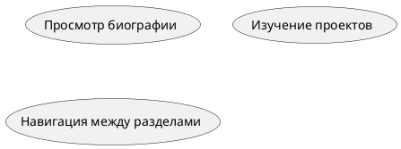

# Документация проекта

## 1. Назначение программы
Веб-сайт предоставляет информацию о технологических проектах Илона Маска (Tesla, SpaceX, Neuralink и др.).  
**Цели**:  
- Интерактивная презентация достижений  
- Адаптивный дизайн для всех устройств  
- Анимированные переходы между страницами  

## 2. Пользователи и бизнес-процессы
### Целевая аудитория:  
- Технологические энтузиасты  
- Исследователи и студенты  
- Журналисты
- Илон Маск

### Бизнес-процессы:  


## 3. Функциональные требования
- Плавные переходы между страницами  
- Карточки проектов с анимацией при наведении  
- Прогресс-бар скролла  
- Мобильная адаптация  

## 4. Системные требования
- Браузеры: Chrome 90+, Firefox 88+  
- Разрешение: от 320px (мобильные)  

## 5. Инструменты разработки
- **Frontend**: HTML5, CSS3, JavaScript  
- **Диаграммы**: PlantUML  
- **IDE**: VS Code  

## 6. Архитектура системы
```
src/  
├── css/  
│   └── styles.css  
├── js/  
│   └── script.js  
├── pages/  
│   ├── spacex.html  
│   └── neuralink.html  
└── images/  
```

## 7. Развертывание
1. Установите веб-сервер (Apache/Nginx)  
2. Скопируйте файлы у разработчика
3. Настройте пути к ресурсам.

## 8. Руководство пользователя
- Навигация: Используйте меню в шапке  
- Карточки: Нажмите для деталей  
- Скролл: Прогресс-бар вверху экрана  